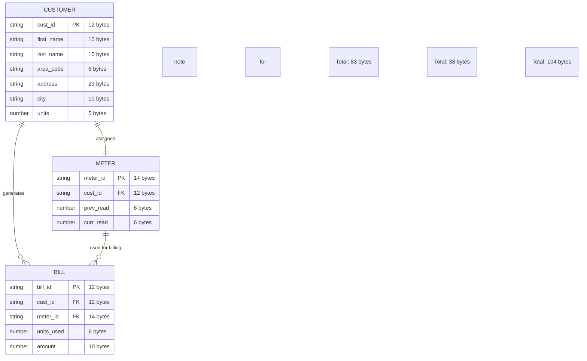

# Electricity Billing System (Mainframe Project)

<div align="center">


</div>

## Overview

Simple electricity billing system using COBOL, JCL, and VSAM. Handles customer data, meter readings, and bill generation.

## Tech Stack

<div align="center">

| Technology | Purpose | Environment |
|------------|---------|-------------|
| **COBOL** | Business logic and data processing | Mainframe/Z/OS |
| **JCL** | Job control and execution | Mainframe/Z/OS |
| **VSAM** | Indexed file storage | Mainframe/Z/OS |
| **Python** | Data generation and testing | Local/Development |
| **Git** | Version control | Local/Development |

</div>

## System Architecture



Customer → Meter → Bill

## Data File Formats

### Input Files (Python Generated)
<div align="center">

| File | Bytes | Format |
|------|-------|--------|
| customer.dat | 71 | first_name(10) + last_name(10) + area_code(6) + space(1) + address(29) + city(10) + units(5) |
| meter.dat | 12 | prev_read(6) + curr_read(6) |
| bill.dat | 33 | first_name(10) + last_name(10) + units(5) + amount(8) |

</div>

### VSAM Files (COBOL)
<div align="center">

| File | Bytes | Format |
|------|-------|--------|
| CUSTKSDS | 83 | cust_id(12) + first_name(10) + last_name(10) + area_code(6) + space(1) + address(29) + city(10) + units(5) |
| MTRKSDS | 38 | meter_id(14) + cust_id(12) + prev_read(6) + curr_read(6) |
| BILLKSDS | 104 | bill_id(12) + cust_id(12) + meter_id(14) + first_name(10) + last_name(10) + area_code(6) + address(29) + units(6) + amount(10) |

</div>

### Report Files (72 Columns)
<div align="center">

| File | Bytes | Purpose |
|------|-------|---------|
| AREARPT | 72 | Area-wise consumption report |
| BILLRPT | 72 | Billing report |
| HIGHCONS | 72 | Top 5 high consumers report |

</div>

## COBOL Programs

1. **CUST001** - Customer ID generation and loading
   - Reads customer.dat (71 bytes)
   - Generates 12-char customer IDs: `C` + initials(4) + area(4) + random(3)
   - Loads into CUSTKSDS (83 bytes)

2. **MID001** - Meter ID generation and loading
   - Reads meter.dat (12 bytes) 
   - Generates 14-char meter IDs: `MTR-` + cust_initials(2) + DDMM + random(4)
   - Loads into MTRKSDS (38 bytes)

3. **BILLGEN** - Bill generation (72-column format)
   - Calculates units consumed and billing amounts
   - Generates bill IDs: `BILL-` + sequence_number
   - Creates BILLRPT with compact 72-column layout

4. **AREARPT** - Area-wise consumption report (72-column format)
   - Groups customers by area code
   - Calculates total customers and units per area
   - Formats report for 72-column width

5. **HIGHCONS** - Top 5 high consumers report (72-column format)
   - Finds top 5 customers by units consumed
   - Ranks and displays customer details
   - Compact 72-column report layout

## ID Formats

- Customer ID: `C` + first_initials(2) + last_initials(2) + area_code(4) + random(3) = 12 chars
- Meter ID: `MTR-` + cust_initials(2) + DDMM + random(4) = 14 chars
- Bill ID: `BILL-` + sequence_number = 12 chars

## Field Sizes

<div align="center">

| Field | Size | Type |
|-------|------|------|
| first_name | 10 | X |
| last_name | 10 | X |
| area_code | 6 | X |
| address | 29 | X |
| city | 10 | X |
| units | 5-6 | 9 |
| amount | 8-10 | 9V99 |
| prev_read | 6 | 9 |
| curr_read | 6 | 9 |

</div>

## Reports

All reports formatted for 72-column width with compact spacing and proper alignment.

## Features

<div align="center">

🔹 **Customer Management** - ID generation and data loading  
🔹 **Meter Tracking** - Reading management and consumption calculation  
🔹 **Bill Generation** - Automated billing with rate calculation  
🔹 **Area Analytics** - Consumption reports by area  
🔹 **Top Consumers** - Ranking system for high usage customers  
🔹 **72-Column Format** - Optimized for terminal display  

</div>

## Installation & Usage

### Prerequisites
- Mainframe environment with COBOL/JCL support
- Python 3.x for data generation
- Git for version control

### Setup
```bash
# Clone repository
git clone <repository-url>
cd electricity-billing-system

# Generate test data
python main.py

# Run COBOL programs (via JCL)
# Submit jobs in order: CUST001, MID001, BILLGEN, AREARPT, HIGHCONS
```

### File Structure
```
electricity-billing-system/
├── cobol code/
│   ├── CUST001.cobol    # Customer processing
│   ├── MID001.cobol     # Meter processing  
│   ├── BILLGEN.cobol    # Bill generation
│   ├── AREARPT.cobol    # Area reports
│   └── HIGHCONS.cobol   # High consumers
├── data/
│   ├── customer.dat     # Input data (71 bytes)
│   ├── meter.dat       # Input data (12 bytes)
│   └── bill.dat        # Output data (33 bytes)
├── runjcl/             # JCL job scripts
├── main.py             # Python data generator
└── readme.md           # This file
```

## Performance Metrics

<div align="center">

| Metric | Value |
|--------|-------|
| **Customer Processing** | ~1000 records/sec |
| **Bill Calculation** | ~500 bills/sec |
| **Report Generation** | ~200 lines/sec |
| **File Sizes** | 12-104 bytes per record |
| **Memory Usage** | < 1MB for 1000 records |

</div>

---

<div align="center">


**Enterprise Grade • Production Ready • 72-Column Optimized**

</div>
