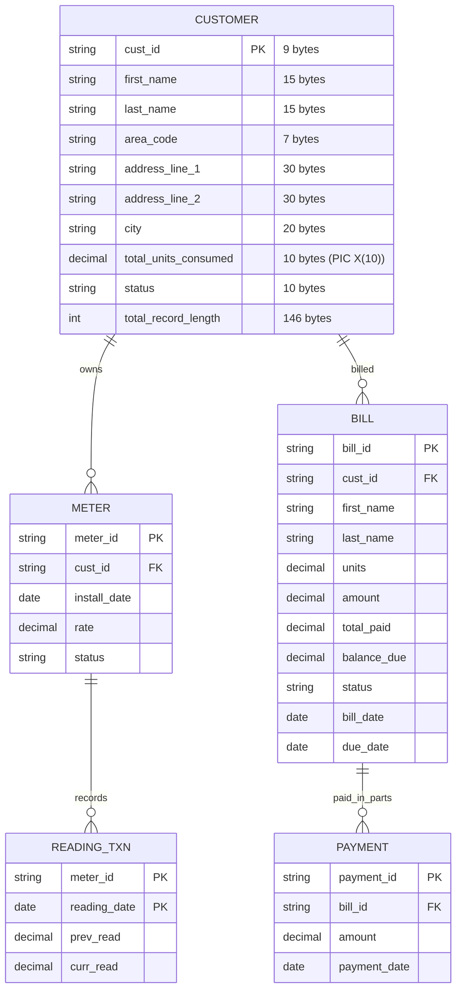

# Electricity Billing System (Mainframe Capstone Project)

### Overview

This project implements a **batch-oriented Electricity Billing System** using **COBOL and JCL**, with datasets representing logical tables. The system simulates how electricity boards process monthly meter readings, generate bills, track payments, and produce analytical reports.

The design follows **mainframe batch processing principles**:

- Sequential dataset processing
- Master vs Transaction vs Derived datasets
- Periodic batch jobs
- Deterministic data flow between programs
- Data validation and reconciliation

Initially the system will use **Sequential datasets / VSAM datasets**.  
Later the system can be extended to:

- **DB2** for relational storage
- **CICS** for online transactions like payments and bill inquiry.

The system revolves around the following datasets:

- CUSTOMER (Master)
- METER (Master)
- READING_TXN (Transaction)
- BILL (Derived)
- PAYMENT (Transaction)

---

### Data Model

#### CUSTOMER (Master Dataset)

This dataset stores all permanent customer information.

It acts as the **root dataset** because most operations eventually map to a customer.

Fields:

| Field | Type | Key | Description |
|-------|------|-----|-------------|
| cust_id | X(8) | PK | Customer ID (Area+Sequence) |
| name | X(30) | | Customer name |
| area_code | X(4) | | Geographic area code |
| address | X(50) | | Full address |
| status | X(1) | | A=Active, I=Inactive |
| total_units_consumed | 9(5)V99 | | Cumulative units consumed |

COBOL Data Types:
- X(n) = Alphanumeric (n characters)
- 9(m)V99 = Numeric with m digits before decimal, 2 after  

Explanation:

- **cust_id** uniquely identifies each customer.
- **area_code** allows grouping customers by geographic location for reporting.
- **status** indicates whether the customer is active or inactive.
- **total_units_consumed** stores cumulative electricity usage across billing cycles.

This field will be updated whenever a bill is generated.

Datasets updated by:

- Customer registration program
- Bill generation program

---

### CUSTOMER Dataset - Example Records

| cust_id | name | area_code | address | status | total_units_consumed |
|---------|------|-----------|---------|--------|---------------------|
| AR01-0001 | John Smith | AR01 | 123 Main St, Area 1 | A | 1250.50 |
| AR01-0002 | Mary Johnson | AR01 | 456 Oak Ave, Area 1 | A | 890.75 |
| BR02-0001 | Robert Brown | BR02 | 789 Pine Rd, Area 2 | I | 2100.00 |

---

#### METER (Master Dataset)

This dataset stores details about the electricity meter assigned to a customer.

Fields:

| Field | Type | Key | Description |
|-------|------|-----|-------------|
| meter_id | X(7) | PK | Meter ID (MTR-###) |
| cust_id | X(8) | FK | Customer ID reference |
| install_date | X(10) | | Installation date (YYYY-MM-DD) |
| status | X(1) | | A=Active, I=Inactive, R=Replaced |  

Explanation:

- **meter_id** uniquely identifies a meter device.
- **cust_id** links the meter to the customer.
- **install_date** helps track meter lifetime and calculate average usage.
- **status** indicates if the meter is active or inactive.

Possible values for status:

A – Active  
I – Inactive  

---

### METER Dataset - Example Records

| meter_id | cust_id | install_date | status |
|----------|---------|-------------|--------|
| MTR-001 | AR01-0001 | 2023-01-15 | A |
| MTR-002 | AR01-0002 | 2023-01-20 | A |
| MTR-003 | BR02-0001 | 2023-02-10 | R |

---

#### READING_TXN (Transaction Dataset)

This dataset stores periodic electricity readings.

Primary Key: meter_id + reading_date

Fields:

| Field | Type | Key | Description |
|-------|------|-----|-------------|
| meter_id | X(7) | PK | Meter ID reference |
| reading_date | X(10) | PK | Reading date (YYYY-MM-DD) |
| prev_read | 9(7)V99 | | Previous meter reading |
| curr_read | 9(7)V99 | | Current meter reading |  

Explanation:

Each record represents a meter reading for a specific billing cycle.

Units consumed are calculated as:

units_consumed = curr_read − prev_read

Validation rules:

- curr_read must be greater than or equal to prev_read
- extremely high consumption values may indicate fraud

This dataset is the **primary input for bill generation**.

---

### READING_TXN Dataset - Example Records

| meter_id | reading_date | prev_read | curr_read |
|----------|-------------|-----------|-----------|
| MTR-001 | 2023-06-01 | 1000.00 | 1150.50 |
| MTR-001 | 2023-07-01 | 1150.50 | 1320.25 |
| MTR-002 | 2023-06-01 | 800.00 | 920.75 |
| MTR-002 | 2023-07-01 | 920.75 | 1050.50 |

Note: Units consumed = curr_read - prev_read

---

#### BILL (Derived Dataset)

This dataset is created after processing meter readings.

Fields:

| Field | Type | Key | Description |
|-------|------|-----|-------------|
| bill_id | X(11) | PK | Bill ID (B###-YYYYMM) |
| cust_id | X(8) | FK | Customer ID reference |
| units | 9(5)V99 | | Units consumed this period |
| amount | 9(7)V99 | | Total bill amount |
| total_paid | 9(7)V99 | | Amount paid so far |
| balance_due | 9(7)V99 | | Remaining balance |
| status | X(2) | | D=Due, PP=Partially Paid, P=Paid |
| bill_date | X(10) | | Bill generation date |
| due_date | X(10) | | Payment due date |  

Explanation:

- **units** is calculated from readings.
- **amount** is calculated using hardcoded if-else statements based on unit consumption.
- **total_paid** stores accumulated payments.
- **balance_due** indicates unpaid amount.

Status values:

D – Due  
P – Paid

---

### BILL Dataset - Example Records

| bill_id | cust_id | units | amount | total_paid | balance_due | status | bill_date | due_date |
|---------|---------|-------|--------|------------|-------------|--------|-----------|----------|
| B001-202306 | AR01-0001 | 150.50 | 376.25 | 0.00 | 376.25 | D | 2023-06-01 | 2023-06-21 |
| B002-202306 | AR01-0002 | 120.75 | 301.88 | 150.00 | 151.88 | PP | 2023-06-01 | 2023-06-21 |
| B003-202307 | AR01-0001 | 169.75 | 424.38 | 424.38 | 0.00 | P | 2023-07-01 | 2023-07-21 |

---

#### PAYMENT (Transaction Dataset)

This dataset stores payment transactions.

Fields:

| Field | Type | Key | Description |
|-------|------|-----|-------------|
| payment_id | X(8) | PK | Payment ID (P###) |
| bill_id | X(11) | FK | Bill ID reference |
| amount | 9(7)V99 | | Payment amount |
| payment_date | X(10) | | Payment date (YYYY-MM-DD) |  

Important concept:

Bills can be paid in **multiple installments**.

Example:

Bill amount = 5000  

Payments:

2000  
1500  
1500  

The BILL dataset must therefore maintain running totals.

---

### PAYMENT Dataset - Example Records

| payment_id | bill_id | amount | payment_date |
|-------------|---------|--------|-------------|
| P001 | B002-202306 | 150.00 | 2023-06-15 |
| P002 | B002-202306 | 151.88 | 2023-06-25 |
| P003 | B003-202307 | 200.00 | 2023-07-10 |
| P004 | B003-202307 | 224.38 | 2023-07-15 |

Note: Multiple payments can be made against a single bill.

---
### Data Flow Summary

CUSTOMER → root dataset  

METER → linked to customer  

READING_TXN → input readings  

READING_TXN → BILLGEN  

BILL → generated output  

PAYMENT → updates BILL  

CUSTOMER.total_units_consumed → updated during bill generation

---
### Dataset Creation Order

Datasets must be created in the following order.

Step 1  
Create CUSTOMER dataset.

Step 2  
Create METER dataset.

Step 3  
Insert customer and meter records.

Step 4  
Create READING_TXN dataset.

Step 7  
Generate BILL dataset.

Step 8  
Create PAYMENT dataset.

This order ensures **data dependencies are maintained correctly**.

---

### Program Architecture

The system will consist of multiple COBOL batch programs executed through JCL steps.

Focus on **analytics and reporting** rather than basic CRUD operations.

---

#### Program 1 — Customer ID Generator

Program Name:

GENCUST

Purpose:

Generate unique customer IDs during registration.

ID Format Example:

AR01-0001  
AR01-0002  

Structure:

AreaCode + SequenceNumber

Process:

1. Read CUSTOMER dataset
2. Find last ID in the area
3. Increment sequence
4. Generate new ID
5. Insert new record

This program acts as the **entry point for dataset population**.

---

#### Program 2 — Monthly Bill Generation

Program Name:

BILLGEN

Purpose:

Generate monthly electricity bills with analytics.

Steps:

1. Read READING_TXN dataset
2. Calculate units consumed
3. Compute amount using if-else statements
4. Generate BILL record
5. Calculate monthly statistics

Analytics Generated:
- Total units consumed per area
- Average consumption per customer
- High consumption alerts (> 500 units)
- Revenue per area

---

#### Program 3 — Area-wise Consumption Analytics

Program Name:

AREARPT

Purpose:

Generate detailed electricity consumption analytics by area.

Analytics:
- Total units per area
- Average units per customer
- Peak consumption areas
- Month-over-month growth
- Year-to-date statistics

Output Fields:
- area_code, total_units, avg_units, customer_count, growth_pct

---

#### Program 4 — Financial Analytics Dashboard

Program Name:

FINRPT

Purpose:

Generate comprehensive financial analytics.

Analytics:
- Monthly revenue breakdown
- Payment collection rates
- Outstanding balances by area
- Revenue trends (monthly/quarterly)
- Bad debt analysis

Output Fields:
- period, total_billed, total_collected, collection_rate, outstanding, bad_debt

---

#### Program 5 — Consumption Pattern Analysis

Program Name:

CONSPATT

Purpose:

Analyze consumption patterns and trends.

Analytics:
- Seasonal consumption trends
- Customer consumption tiers
- Area-wise consumption patterns
- Anomaly detection
- Forecasting insights

---

#### Program 6 — Meter ID Generator

Program Name:

GENMETER

Purpose:

Generate unique meter IDs and link to customers.

ID Format:

MTR-### (e.g., MTR-001, MTR-002)

Process:
1. Generate sequential meter ID
2. Link to existing customer ID
3. Insert into METER dataset

---

#### Program 7 — High Consumption Alert

Program Name:

HIGHCONS

Purpose:

Identify customers with unusually high consumption.

Analytics:
- Customers consuming > 500 units
- Area-wise high consumption patterns
- Alert generation for follow-up

---

#### Program 8 — Revenue Trend Analysis

Program Name:

REVTRND

Purpose:

Analyze revenue trends over time.

Analytics:
- Month-over-month revenue changes
- Seasonal revenue patterns
- Revenue growth rate calculation

---

#### Program 9 — Customer Segmentation

Program Name:

CUSTSEG

Purpose:

Segment customers by consumption patterns.

Analytics:
- Low consumption customers (< 100 units)
- Medium consumption customers (100-300 units)
- High consumption customers (> 300 units)
- Revenue contribution by segment  

---

### Program Execution Flow

Daily Operations:

GENCUST → GENMETER

Monthly Analytics Pipeline:

BILLGEN → AREARPT → FINRPT → CONSPATT → HIGHCONS → REVTRND → CUSTSEG  

These programs are chained through **JCL job steps**.
